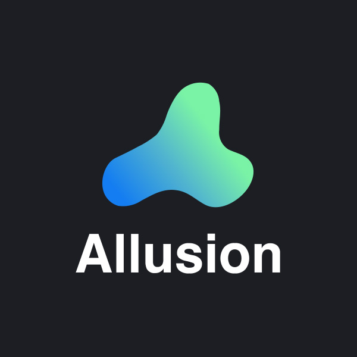

Allusion is a tool built for artists, aimed to help you organize your **Visual Library** – A single place that contains your entire collection of references, inspiration and any other kinds of images.

[Read more about Allusion →](https://allusion-app.github.io/)

## Installation

Find the latest version of Allusion on the [Releases](https://github.com/allusion-app/Allusion/releases) page.
The application can be automatically updated when a new version becomes available.

## Development

### Quick Start

You need to have [NodeJS](https://nodejs.org/en/download/) and a package manager such as [Yarn](https://yarnpkg.com/lang/en/docs/install/) installed.
Then run the following commands to get started:

1. Run `yarn install` to install or update all necessary dependencies.
2. Run `yarn dev` to build the project files to the `/build` directory. This will keep running to immediately build changed files when they are updated.
3. In a second terminal, run `yarn start` to start the application. Refresh the window (Ctrl/Cmd + R) after modifying a file to load the updated build files.

### Release Build

An installable executable can be built using `yarn package` for your platform in the `/dist` folder. The building is performed using the [electron-builder](https://www.electron.build/) package, and is configured by a section in the `package.json` file.
Builds are automatically published to Github Releases when a tag is created in GitHub.

## Further Information

We moved anything related to documentation or answers to frquently asked questions into our [wiki](https://github.com/allusion-app/Allusion/wiki).
